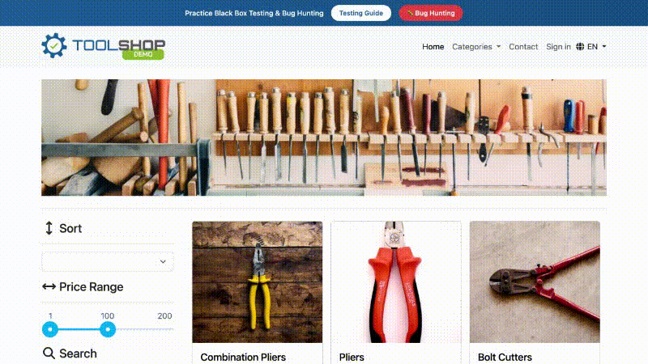

# webtask

[](https://pypi.org/project/pywebtask/)
[](https://github.com/steve-z-wang/webtask/actions/workflows/pr.yml)
[](https://opensource.org/licenses/MIT)
[](https://steve-z-wang.github.io/webtask/)

Easy-to-use LLM-powered browser automation — from autonomous tasks to element-level control.

## Why webtask?

- **High-level tasks**: Describe what you want done — the agent figures out the steps
- **Low-level control**: Select any element with natural language — no CSS/XPath selectors needed

## Demo

```python
await agent.do("add 3 Flat-Head Wood Screws to the cart")
```



[View full example](examples/demo_video.py)

## Installation

```bash
pip install pywebtask
playwright install chromium
```

## Quick Start

```python
from webtask import Webtask
from webtask.integrations.llm import Gemini

wt = Webtask()
agent = await wt.create_agent(
    llm=Gemini(model="gemini-2.5-flash"),
    wait_after_action=1.0,
)

await agent.goto("https://practicesoftwaretesting.com")
await agent.wait(3)

# select: pick elements with natural language
search = await agent.select("the search input")
await search.fill("pliers")

# do: simple or complex tasks — agent figures out the steps
await agent.do("click search and add the first product to cart")

# extract: get structured data from the page
price = await agent.extract("the cart total price")

# verify: check conditions
assert await agent.verify("cart has 1 item")
```

## Features

**Four core operations**

```python
await agent.do("click search and add first product to cart")  # Autonomous tasks
element = await agent.select("the search input")              # Element selection
data = await agent.extract("the cart total", MySchema)        # Data extraction
assert await agent.verify("cart has 1 item")                  # Verification
```

**Stateful agents** — Agent remembers context across tasks

```python
await agent.do("Add pliers to cart")
await agent.do("Add a hammer too")  # Remembers previous action
agent.clear_history()               # Reset when needed
```

**Two modes** — DOM-based or pixel-based interaction

```python
agent = await wt.create_agent(llm=llm, mode="dom")     # Element IDs (default)
agent = await wt.create_agent(llm=llm, mode="pixel")   # Screen coordinates
```

**Browser integration** — Works with new or existing browsers

```python
agent = await wt.create_agent(llm=llm)                                  # New browser
agent = await wt.create_agent_with_browser(llm=llm, browser=browser)    # Existing browser
agent = wt.create_agent_with_context(llm=llm, context=context)          # Existing context
agent = wt.create_agent_with_page(llm=llm, page=page)                   # Existing page
```

**Error handling** — Handle task failures gracefully

```python
try:
    await agent.do("Add item to cart")
except TaskAbortedError as e:
    print(f"Task failed: {e}")
```

## Supported LLMs

```python
from webtask.integrations.llm import Gemini, GeminiComputerUse, Bedrock

Gemini(model="gemini-2.5-flash")                                # 2.5 Flash
GeminiComputerUse(model="gemini-2.5-computer-use-preview")      # Visual mode
Bedrock(model="anthropic.claude-sonnet-4-20250514-v1:0")        # Claude 4 Sonnet (WIP)
```

You can also use your own LLM by implementing the `LLM` interface. See the [custom LLM guide](https://steve-z-wang.github.io/webtask/guides/custom-llm/).

## Links

- [Documentation](https://steve-z-wang.github.io/webtask/)
- [Benchmarks](https://github.com/steve-z-wang/webtask-benchmarks)

## License

MIT
